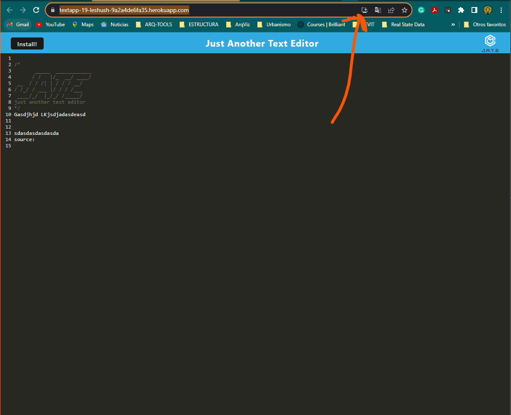

# 🌐 JATE

## 📸 Screengrab

**JATE** stands for "Just Another Text Editor", but it's more than that. It's a Progressive Web App (PWA) that offers a seamless text editing experience, both online and offline. Designed with simplicity in mind, JATE provides a distraction-free environment for all your writing needs, whether you're jotting down quick notes or drafting long-form content.

## 🌟 Features

- **Installable**: Use JATE as a standalone app on your device.
- **Small**: Lightweight and fast, ensuring a smooth user experience.
- **Compact**: A minimalist design that keeps the focus on your content.

## 📌 Prerequisites

- A modern web browser that supports PWAs (like Google Chrome, Firefox, or Edge).
- An internet connection for the initial setup and download.

## 🚀 Installation

1. Navigate to the JATE app on Heroku.
2. On the address bar of your browser (specifically in Chrome), you'll notice an 'Install' icon (usually represented as a `+` or a download icon).
3. Click on it, and JATE will be installed on your device as a PWA, allowing you to access it even offline.

## 🖥️ Usage

1. Once installed, you can launch JATE from your device's app list.
2. Start typing! Your content will be saved locally, ensuring you don't lose your work even if you close the app.
3. For syncing or saving your content online, ensure you have an active internet connection and use the 'Save' or 'Sync' button within the app.

## 🤝 Contributing

We believe in the power of community. If you'd like to contribute to JATE:

1. Fork the Project.
2. Set up your local development environment.
3. Create your Feature Branch (`git checkout -b feature/YourFeatureName`).
4. Commit your Changes (`git commit -m 'Add some AmazingFeature'`).
5. Push to the Branch (`git push origin feature/YourFeatureName`).
6. Open a Pull Request with a detailed description of your feature.

## 📜 License

This project is licensed under the MIT License - see the [LICENSE.md](./LICENSE) file for details.

## 📞 Contact

👤 **le-shush**

- GitHub: [@le-shush](https://github.com/le-shush)
